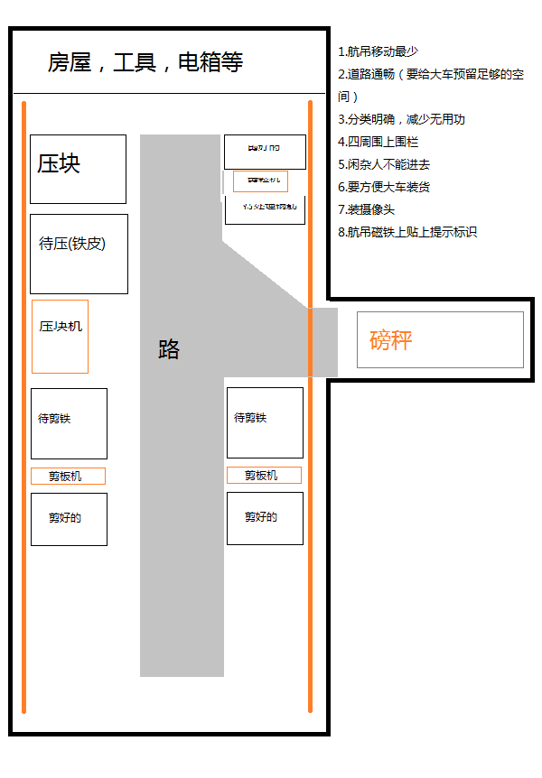
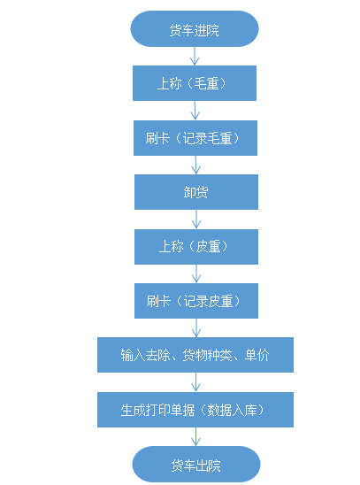
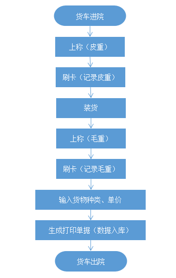

# 任务看板

## 1.工人问题

- 工人作息时间
- 值班人员安排
- 劳动合同问题
- 招聘相关

## 2.安全生产

- 安全事项

    航吊：操作规范，张贴安全提示标语，航吊下不可站人，轨道上不可站人停车等，航吊使用完毕必须落地断电，遥控器不可离开操作人员

    压块机：操作规范，张贴安全提示标语，压块机上不可站人，不可用手或脚去调整废铁位置，可以借助工具，废铁填充要求（不能有密封容器，减震器等），压块机使用完毕必须将盖板放下并断电

    剪板机：操作规范，张贴安全提示标语，剪板机使用时闲杂人不得靠近
    
    工人着装要求：工作服，安全帽，手套，防扎防砸鞋子

## 3. 场地布局

- 减少航吊移动，控制航吊移动范围，这里主要考虑将航吊各种操作（装货，卸货，整理货物）进行频率排序，设计出最优的布局

- 道路通畅，不能因为道路问题影响生产效率，如装车时大车进来必须有足够的空间移动。

- 分类明确，减少无用功，比如某一块铁在卸车时就应该已经去到该去的地方，不能因为卸货位置不对再重新移动它。

- 四周围上围栏，这个主要是控制闲杂人员的，由于无法保证闲杂人员的安全，闲杂人员不得入内，进入生产区必须佩戴安全帽。

- 摄像头，这个是为了采集图像，遇到事情的时候可以通过视频还原事发时的情况。

## 4. 工资结构

首先将工资分割成固定部分和浮动部分，浮动部分按照绩效发放。

这里要做绩效，必须有可量化的任务，所以必须将工人干的活量化，比如压块一吨多少绩效，剪板机处理一吨多少绩效。

调动工人积极性（待商榷）

## 5. 生产流程（最佳实践）

### 入库流程

### 出库流程

## 6. 交易管理平台（电脑记录），这个很重要，没有数据记录，没法做相关的分析

[相关文档](../信息化管理平台/信息化管理平台设计.md)

## 7. 客户手上的小程序（查看自己的交易记录）

## 8. 客户维护
 
## 9. 法律法规，环保等